# Git Tutorial

## Table of Contents

1. [Git commit messages](#git-commit-messages)
2. [Command-Line Fundamentals](#command-line-fundamentals)
3. [Git Branches](#git-branches)
4. [Advanced Topics](#advanced-topics)
5. [Squashing Commits](#squashing-commits)
6. [Git Stash](#git-stash)
7. [Git Garage Collection](#git-garbage-collection)

Git is a version control system that allows developers to track changes in their code. Github is a web-based hosting service for git repositories. In simple terms, you can use git without Github, but you can not use Github without Git.

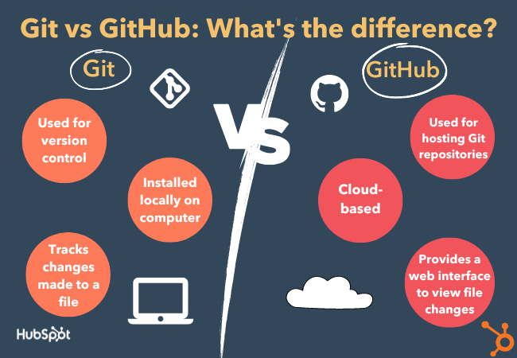

If you are working alone for your personal project Git should do it , but if you work with a group of people on the project then you should probably think of using hosting service like Github.

Let's learn basics of Git together.

## Git Commit Messages {#git-commit-messages}


Commit messages summarize what a commit does. They provide context on why something was changed. They improve maintainability for your future.

***Note:*** You can see what was changes with git diff command.

### How to write a good commit message

1.Split logical changes into separate commits.

- If you worked on several features all day ? - Split them!
- Use git command line or VSCode make it easy to separate the changes and commit.

2.Use the imperative for your title.
-As an example  **Add** new hero section to home

3.Use a short title
 -Git head commit message can go up to 50 characters.
 -Most git tools are optimized to show the summary but only up to a point , so be careful if it exceeds the amount of character.

4.Include your ticket ID
-To avoid random changes include your task number in the commit.Use them in the title!
-[#YourTaskID] Add new hero section to home

5.Use multiple lines in a commit message.
-The first line is the headline(includes the task number and imperative what it does)
-Then a blank line
-Then follows an explanation of what this commit changes and why/how it works

## Command-Line Fundamentals

If you ever need a help with git commands the syntax for that is

```cmd
git help <verb>
or
git <verb> --help
```

Two common scenarios for people to use git:
-You have local project on your local machine that you want to start tracking with Git
-You have existed project remotely that you want to  develop.

Initializing a repository from existing code:
Go to the directory and run the following command

```cmd
git init
```

This will create a directory named **.git** and that directory will contain all the relevant logic to track your files.

If you want to stop tracking your project with Git then run the following command

```cmd
rm -rf .git
```

### .gitignore file

There are a lot of files that contain personal preferences, environment variables , operating system specific files that are not part of our project. To avoid committing them to the repository we can utilize .gitignore file.

Let's say that we don't want to keep track the file called .project , we would like to have .gitignore file in the project directory and place this in it.

```cmd
.project
```

There is one command in git that displays the state of the working directory and the staging area which is ;

```cmd
git status
```

In git there are 3 states that we need to know about;
1- **Working Directory**  untracked and modified files will be in here and you can check them with git status
2-**Staging** area is  where we organize what we want to be committed.We can pick and choose what we want to commit
3-**.git directory(Repository)**

If we want to add all the files that are untracked or modified to staging area the we can run ;

```cmd
git add .
git add -A
```

If you want to add specific file;

```cmd
git add .ignore
```

If you want to remove the files from staging area ;

```cmd
git reset
```

### Committing the Files

After adding the files to staging are next should be the committing them. To commit the changes you can follow the next command

```cmd
git commit -m "[#1111] Add new hero section to home"
```

or you can just run the command `git commit` , this will open vim by default for you to add your commit messages.

To change default editor with the others (in this case VSCode)

```cmd
git config --global core.editor "code"
```

After you finished your commits when you run git status you will get message ***nothing to commit,working directory clean*** message.

If you want to see your all commit history , you might want to run ;

```cmd
git log
git reflog
git log --oneline
```

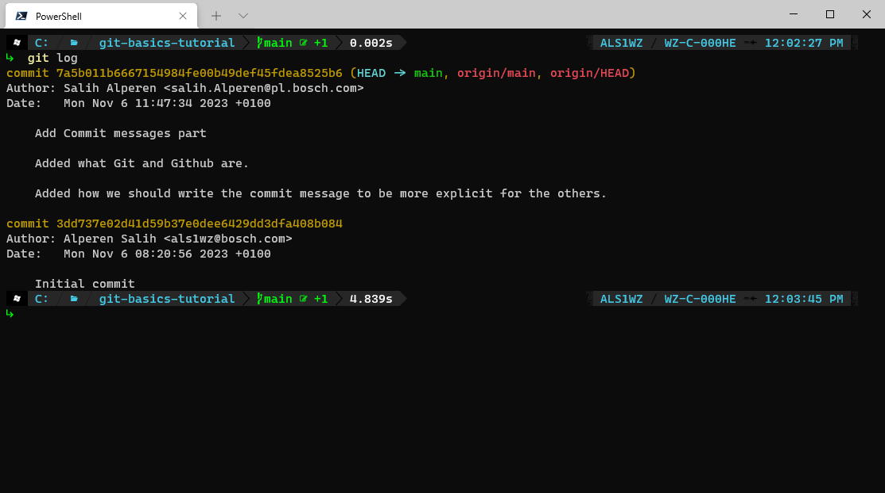

We are in good shape working with local repositories thus far.Lets learn more for remote repositories.

### Working with a remote repository

In order to have copies from remote repositories , you should run the following command ;

```cmd
git clone https://github.boschdevcloud.com/user/dummy.git
```

You can view the information about remote repository by running ;

```cmd
git remote -v
git branch -a
```

After changing your files and adding them to the staging area stays exactly the same. Since we are working anymore with remote repository other developer have been pushing their changes into the repository, while we are working on our own features. So to keep our local files up to date we need to pull the changes by ;

```cmd
git pull
```

Then we can push our changes to remote repository with `git push`

## Git Branches

Core concepts of Git. You can do endless amount of things with them , creating ,deleting ,comparing, publish ,merge and so on.

### The 'HEAD' Branch

It refers to the branch that you are currently working at or checked out branch. There can be only one HEAD branch at a single time.

### Distinction between Local & Remote Branches

When we are working with Git ,most of the time we are working in our local Git repository. The remote branches are most likely one of in Github,GitLab, BitBucket , Azure Devops.

### Creating Branches

You are create branches in couple of ways. The most basic way is ;

```cmd
git branch nameOfBranch
```

Just by providing branch name to the git, it will assume that we want to start new branch based on the currently checked out revision. So new branch will have the same content we were at.

If we want to create a branch based on another revision we should give more information to the Git. See the following command ;

```cmd
git branch newBranch 2b34324e
```

You can create branches only in your locally. Creating branches in a remote repository , happens by publishing an existing local branch.

### Switching Branches

To change the content of the code you should first switch to the specific branch. The HEAD branch defines the context of your work is in at the moment where new commit will be created on

```cmd
git checkout branchName
```

In recent git updates a new command has been added to the git command palette and its only job is to switching branches. So it is the best practice of doing that. See the following example

```cmd
git switch branchName 
```

### Renaming Branches

If you had the typo during the creation of the branches or changed your  mind after , you can correct them by using ;

```cmd
git branch -m newBranchName
```

However if you want to rename another branch , not the HEAD or checked out branch you should provide old branch name and the new one ;

```cmd
git branch -m oldBranchName newBranchName
```

Note : These methods can only change the local branches name , in practice renaming remote branches can be done by deleting the old one and the pushing up the new one from your local repository.

```cmd
git push origin --delete oldBranchName

git push -u origin newBranchName
```

### Publishing Branches

As we already discussed in the previous session , it is not really possible to create a new branch on a remote repository. What we can do however, is republishing an existing local branch on a remote repository.
So lets see how we can do that.

```cmd
git push -u origin localBranchName
```

Note : -u flag in a nutshell , it tells Git to establish a tracking connection. Pushing and pulling will be  much easier.

By default local and remote branches have nothing to do with each other.They are stored and managed as independent objects in Git. But in real life we want to have a  relationship with each other.

We can also download or track a remote branch and bring into our local repository.In the end you will have a tracking connection as well.Lets say that you have feature/login branch in your remote repository and you would like to bring it in your local repository as follows ;

```cmd
git branch --track feature/login origin/feature/login
```

By running this command we created a local branch called feature/login,that is based on origin feature login. Another way to do that ;

```cmd  
git checkout --track origin/feature/login
```

We did not specify a local branch name , it takes the name from remote repository.

After tracking connection is set up synchronizing your local + remote branches are so easy.

```cmd
git pull
git push
```

### Deleting Branches

Most of branches are not meant to live forever. We should keep our workspaces clean and efficient, to do that we should delete the branches that are not needed anymore.

#### Deleting a local branch

```cmd
git branch -d branchName
```

**Note:** You can not delete HEAD branch

#### Deleting a remove  branch

```cmd
git push origin --delete feature/login
```

### Merging Branches

Integrating changes from another branch into your current HEAD branch. Checked out branch should receive the change. Let's say that you have a feature/login branch and you would like to bring the changes into main as follows ;

```cmd
git switch main
git merge feature/login
```

Note: Merging the branches most often creates new commit message.

### Rebasing Branches

An alternative way to integrate changes from another branch into your current local HEAD branch.Let's say that you have feature/login branch that you have been working on for some time and in the meantime your colleagues have been committing changes to  main branch. You would like to update your feature branch with the changes in main so ;

```cmd
git switch feature/login
git rebase main
```

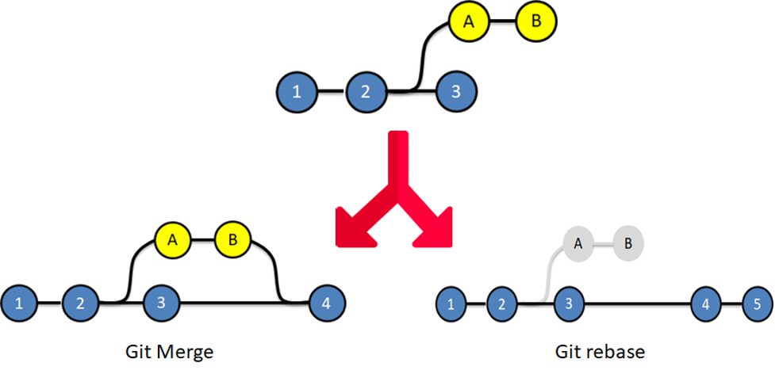

Note : Rebase does not make history as branches ,but shows it as a single line.

### Comparing Branches

Checking which commits are in branch-B but not in branch-A

```cmd
git log main..feature/login
```

Note: Shows the commits are in feature/login branch ,but not in the main branch

## Advanced Topics

### The Perfect Commit

Let us talk about how to create the perfect commit. We can break this topic in two parts :

1- Add the right changes!

Our goal is to create a commit that make sense one that includes changes from a `single topic`. In contrast to the easy way when we just jam all of our current  changes into one commit.

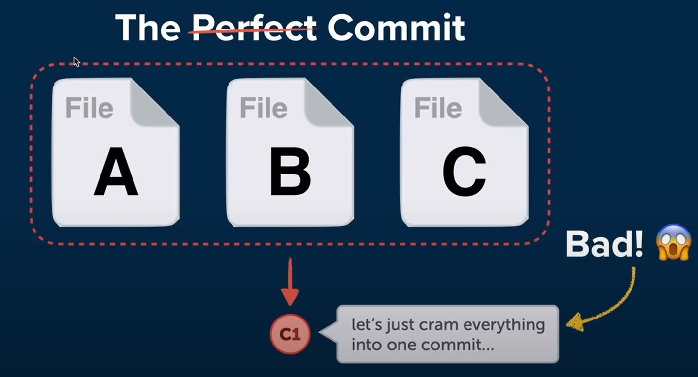

Instead you should group them and commit as most sensible as it can get. The bigger a commits gets, more topics are mixed into the commit , the harder it gets to your colleague.

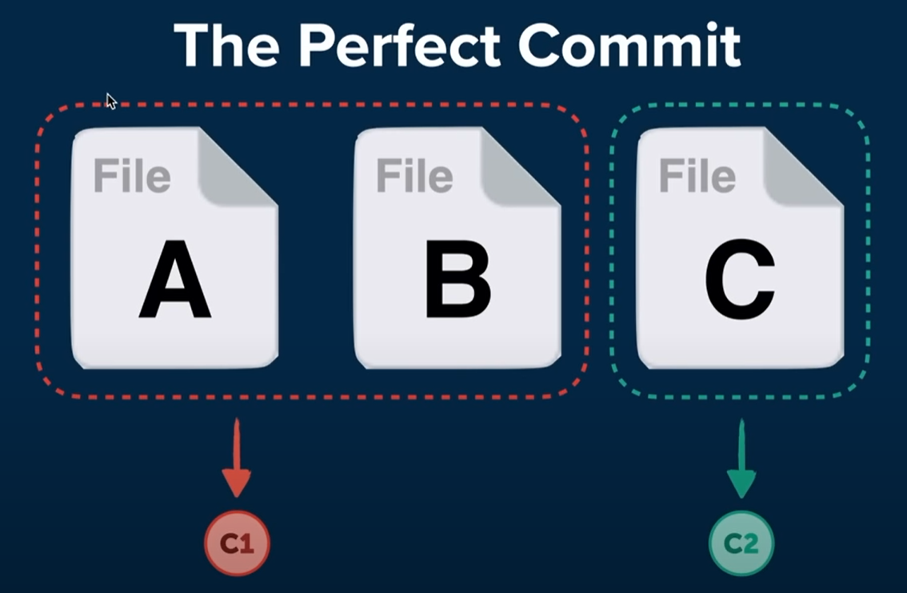

> You can even stage some part of the modified file and the other part can just stay for other commit. You can do that with ;

```cmd
git add -p index.html
```

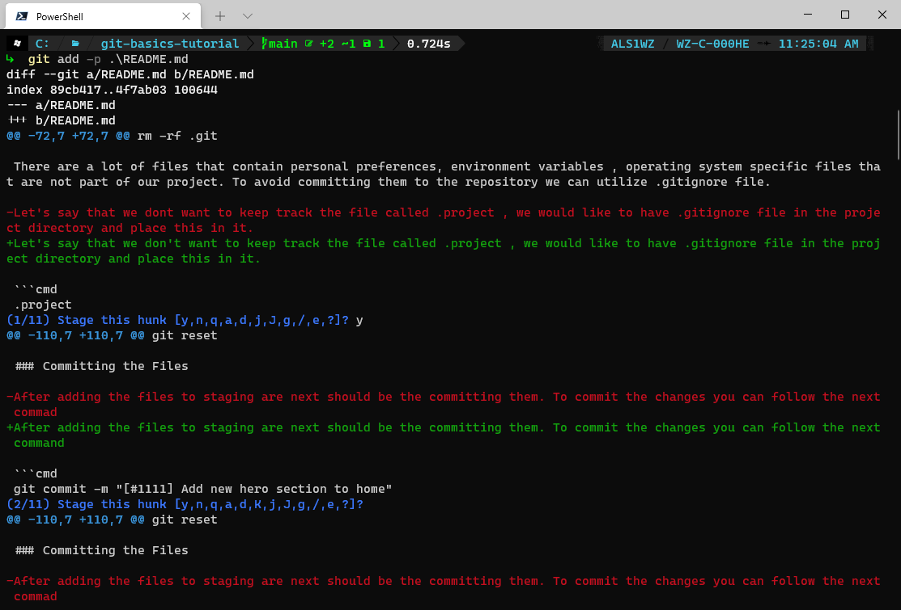

This will take you to patch level and you can decide what to add and whatnot.

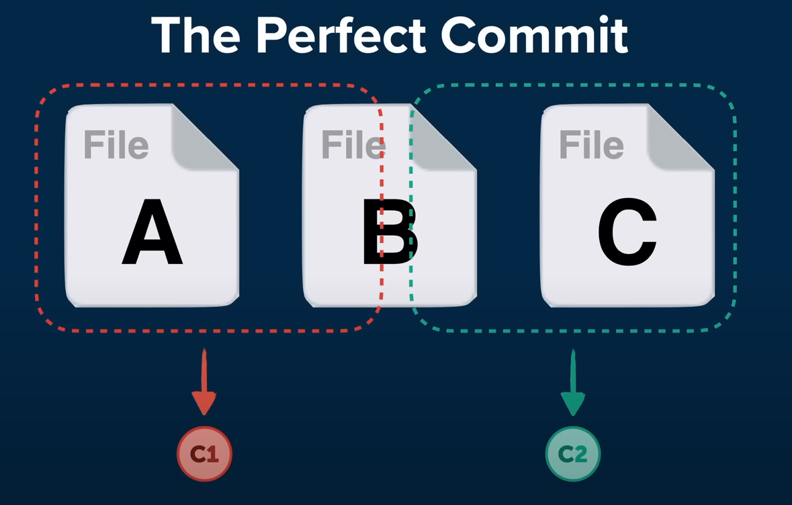

2- Compose a good commit message!

For the basics part of commit messages please refer the [commit messages](#git-commit-messages)

### Branching Strategies

Git is just a tool , and leaves branching concept completely up to you.You and your team are liable for using it in the optimal way. What you need to have as start is a well-written convention ;

- Git allows you to create branches - but it does not tell you how to use them.
- You need a written best practice of how work is ideally structured in your team (avoid mistakes and collisions)
- It highly depends on your team/team size, on your project and how you handle releases.
- It helps to onboard new team members (they know how to start with huge project)

### Integrating Changes & Structuring Releases

1. Mainline Development - Always be integrating
2. State,Release,and Feature Branches

1.Mainline Development

- very few branches
- relatively small commits
- high-quality testing & QA standards

The premise in this model is that code is integrated very quickly into your main line or production code. Your commits should be very small since you can not risk bloated commits in such an environment  where things are constantly integrated into the production code.

Note : To adapt mainline development strategy you must have high quality testing environment setup. Otherwise this approach will not work for you.

2.State,Release,and Feature Branches

- different types of branches
- fulfill different types of jobs
- release is quite easier and safer

In this type of concept every branches having different job to fulfill.New features , bugs and experiments are kept in their own branches. It is not like one approach is better than the other , it is more like needs are different in terms of the project.

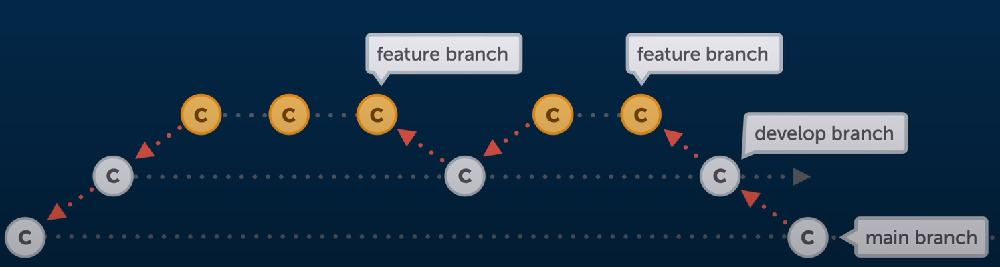

#### Long-Running Branches

- exist through the complete lifetime of the project
- often, they mirror "stages" in your dev life cycle
- common convention : ***no direct commits!***

#### Short-Lived Branches

- for new features , bug fixes , refactoring , experiments etc.
- will be deleted after integration (merge/rebase)

### Pull Requests

It is not a core feature of Git. They are provided by Git hosting platform ,which also means they work and look a little bit different than each other. The basic ideas always the same.

#### Why would you use Pull Requests ?

In essence , they are a way to communicate about code and review it. When you implement a complex feature , you would like to merge those changes into your main branch and sometimes it is better to have a second pair of eyes to look over the code. And this reason is exactly what pull requests were made for. Reviewer can reject the pull request , give you hint to better implementation and so on.

`Fork` is your personal copy of a git repository. The basic connection between Pull Request of Fork is that you after getting the copy of the original repository you can make your changes in your forked version and open a pull request to include those changes into the original repository.

### Merge Conflicts

Lets understand when merge conflicts might occur , what they actually are and how to solve them.

- They occur when you integrate when merge changes from a different source. Not only for merging branches , rebasing , interactive rebasing, cherry pick or pull and many more reason.

- Most of the time Git is able to figure things out on its own. There are few situations where contradictory changes we made where human decision comes to play, and help to technology. These can happen ;
  - When same line changes in different branches
  - When a file deleted in a branch but changed in another branch

`To solve the conflict` we should we clean up the file and make them look like want it to be. This process sometimes force you to contact to other colleagues to find a way to mix or adapt one change.

#### How to undo a conflict and start over

You can always undo and start fresh

```cmd
git merge --abort
git rebase --abort
```

### Merge vs Rebase in detail behind the scenes

Having separate containers for the specific work is incredibly helpful. The most common ways to integrate branches are doubtless merge and rebase as we talked about it earlier.

> Please keep that in mind the goal of an integration is to combine the current states of two branches.

#### How a merge works

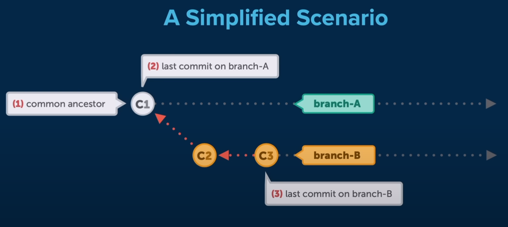

Let's consider you have a separate branch from your main branch that you work on a feature(branch-B). There is always a ancestor commit that you share the same content with feature branch(C1). After completing your implementation you might want to integrate those into your main branch(branch-A).

To do that you would  run `git merge branch-B` in branch-A branch.
In this case you would have fast-forward merge and both branches would have the same history.Git basically takes your commits from features branches and add on top of last common commit.

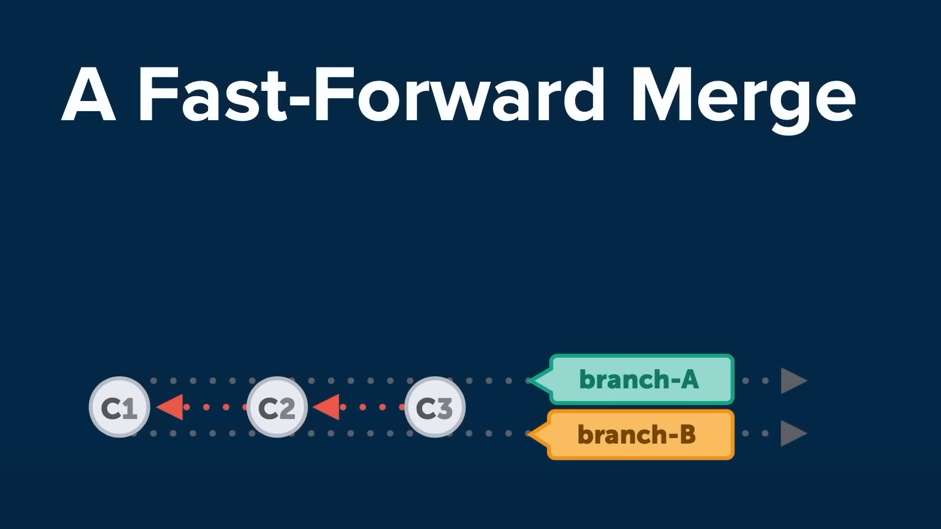

But this example really is not  much realistic because as you have been working on your feature branch your colleague attribute to the main branch. So both branches move forward differently.

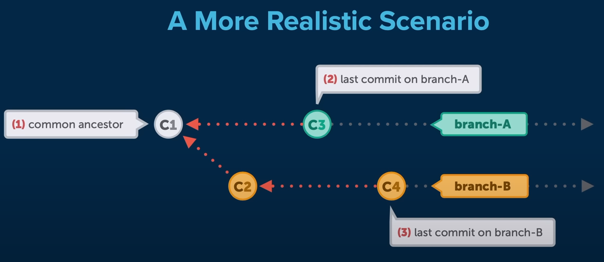

As you see in the picture above you diverged from branch-A with the commit of C1 and you currently don't have C3 branch in your feature branch. In that case , Git will have to create a new commit that contains differences between them. This is what we call a `Merge Commit`

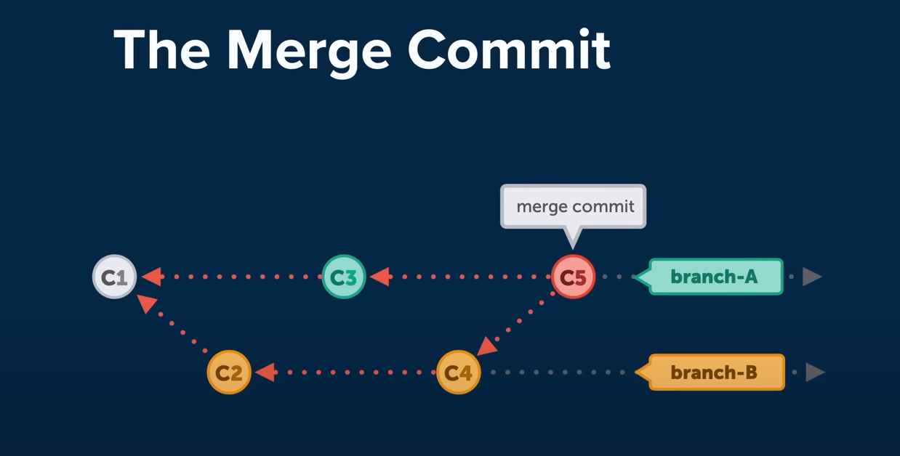

#### Rebase

> Before we start , it is important to know rebase is not better or worse than merge. Most importantly , its different.

Some developers do not want to have a merge commit additionally , so they prefer rebase.They want the project history to look like straight line without any sign of branching even after branches have been integrated. Rebase can help you achieve this.

`Friendly Reminder` Do NOT use Rebase on commits that you have already pushed/shared ona remote repository.Instead, use it for cleaning up your local commit history before merging it into a shared team branch.

For the same scenario integrating changing from branch-B to branch-A
you would run the command `git rebase branch-B`.

Let us see what happens behind the scene ;

First git will take all the commits on branch-A  after the common ancestor and save them somewhere temporarily.

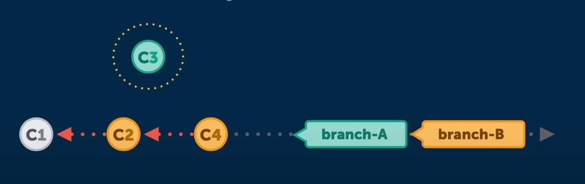

Then git applies to new commits from branch-B and at this point both branches look exactly the same , then the final step those commits from branch-A  will be included on top commits from branch-B.

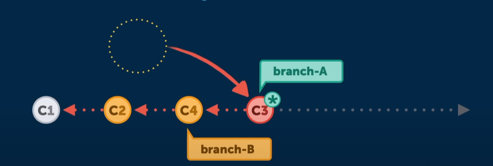

**Note:** Rebase re-writes commit history ,after final step old C3 commit and new C3 commits are changed.

## Squashing Commits

Squash is not a command , it is actually one of many options available to you under git interactive rebasing system.The common way to use squashing is to repackage commits that are related to each other. It could be multiple commits that fix a bug or feature.

```cmd
git rebase -i HEAD~3
```

**Note:** This will that git that we want to act and operate upon the last two commits back from head.

Then git will open your default  terminal text editor (most likely vim) and present you with a list of commits.

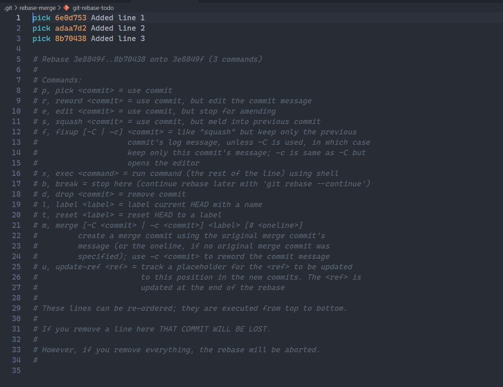

Then we want to squash last 2 commits into the first one , so make the changes ;

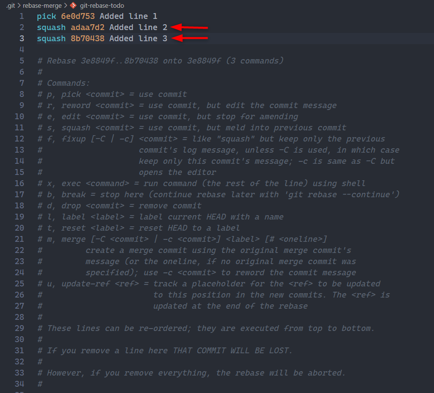

After this git will pop up new editing window for your last commit messages you can combine those commit messages into one commit or leave the way it is.

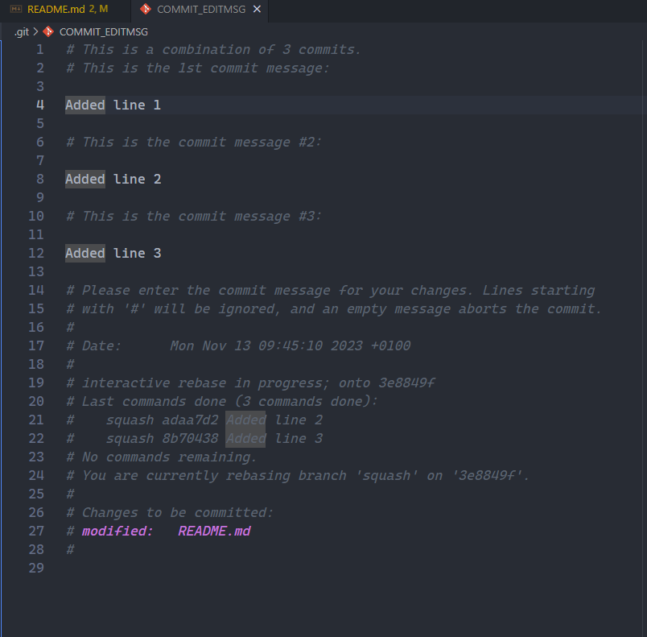

Log will be look like shorter and clean

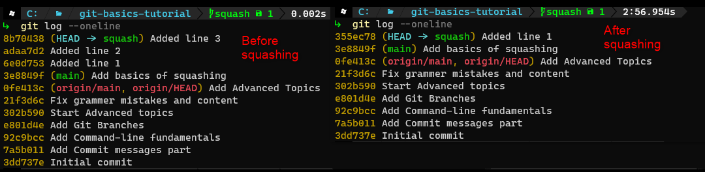

## Git Stash

Git stash is a pretty cool git feature that allows you to keep your changes somewhere temporarily if you are not sure to commit them but you still want to keep them. Another nifty use-cases;

- If you want to go back to where you are in the working directory
- If you need to switch branches or need to move your changes from one branch to another

### Applying stash

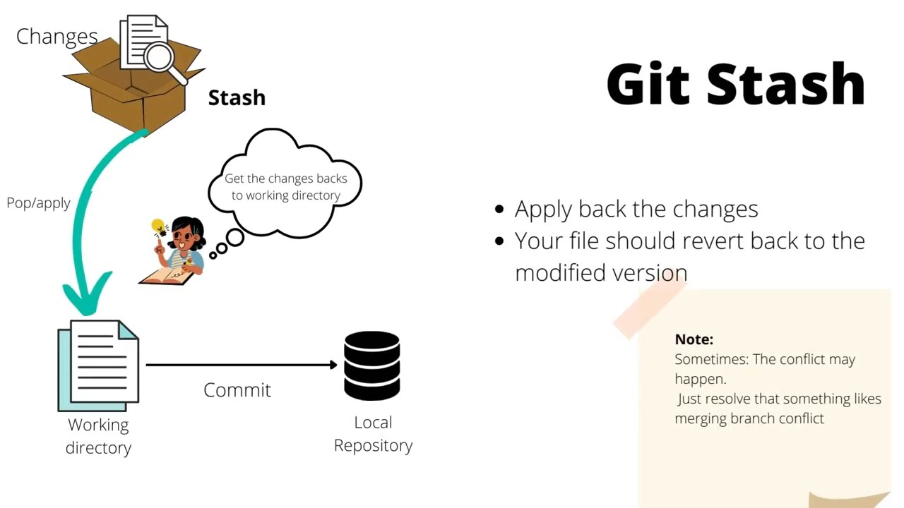

There are different ways to do a stash in Git ,one of the most common ways is ;

```cmd
git stash save "your stash message"
```

After running this command you will go back to clean working directory state that you sync your changes last time. Now if you want to see your stashes (might have more than 1) ;

```cmd
git stash list
```

If you want to get back your changes after some time you have two ways to do that.

```cmd
git stash apply '{stash@{0}}'
```

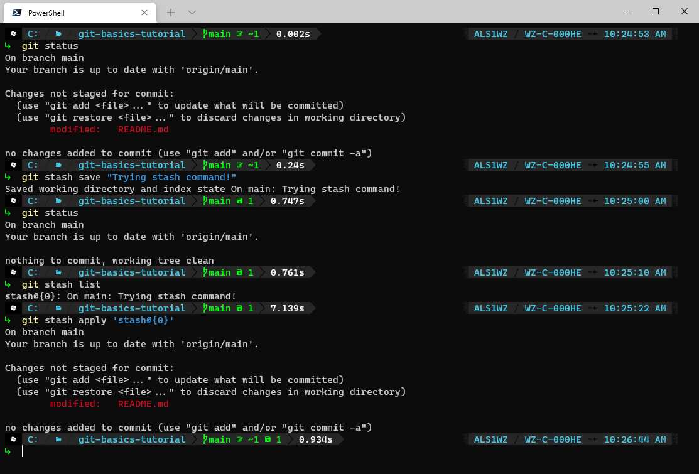

The other way is to use `pop` method. The difference between apply and pop is that when you run pop command stash will no longer be in your stash list , however apply will keep those until you drop them. `Pop` will always remove the top stash for you.

```cmd
git stash pop
```

If you like to drop individual stash from your stash list ;

```cmd
git stash drop '{stash@{0}}'
```

If you want to get rid of all stashes you have ;

```cmd
git stash clear
```

**Note:** Even if you drop after applying the stash your changes will be gone.

## Git Garbage Collection

Garbage Collection `git gc` will perform some cleaning on your local repository

- Delete old unreachable (detached) commits
- Compress similar objects into `packs`

> Garbage collection can be performed on demand with `git gc --auto`

### When should you use garbage collection ?

Git gc can be required if ;
  
- You have recently changed a lot in your repository
  - `git gc --prune=now`
- You want to delete a large folder from the repository e.g  node_modules.
- You want to undo commits and remove them from history
